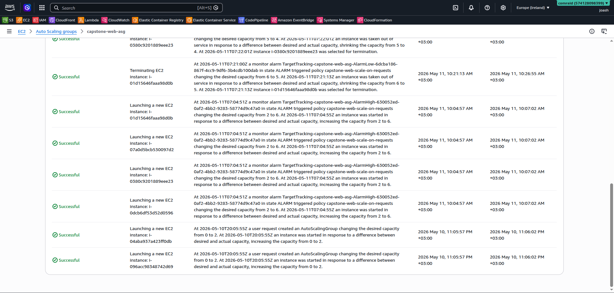
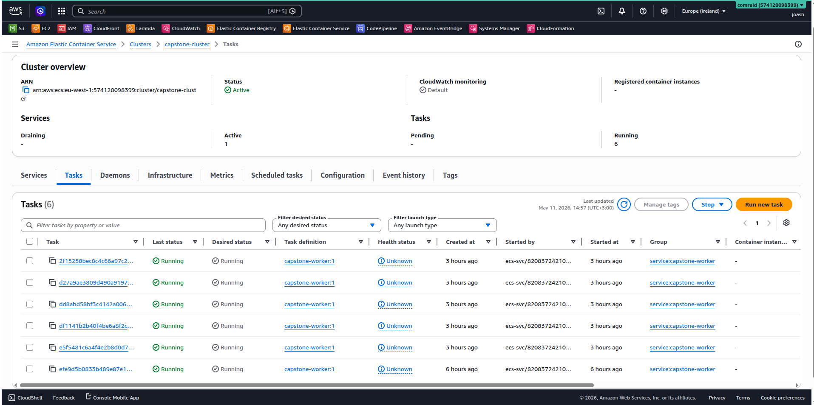
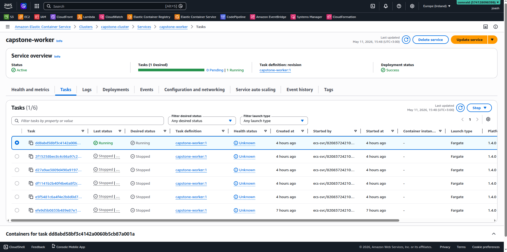
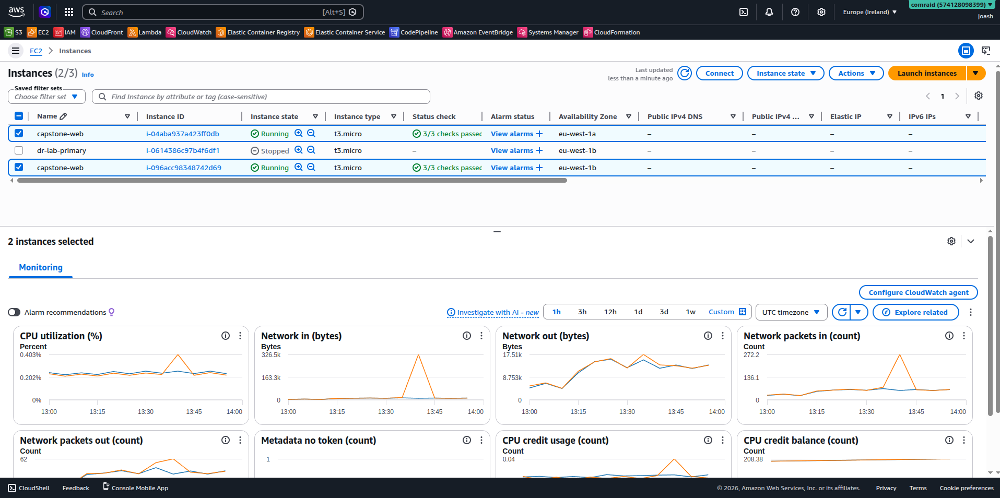
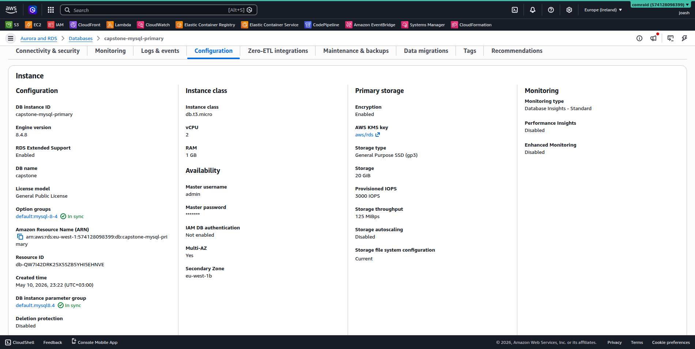
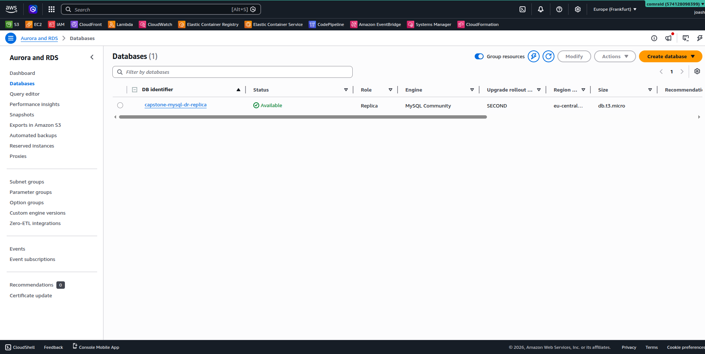
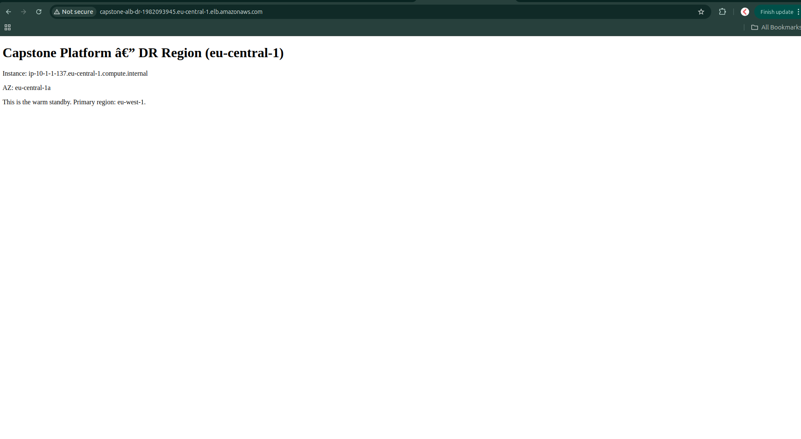
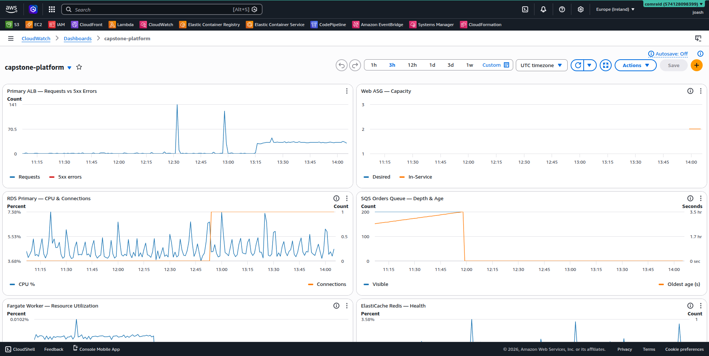
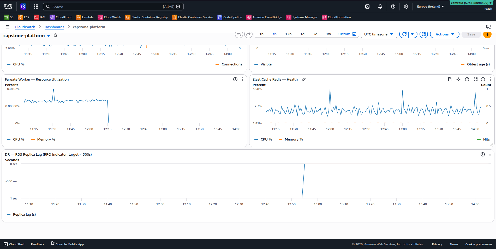

# Capstone Lab — Resilient, Scalable & Recoverable AWS Architecture

> **Course:** Moringa AWS DevOps Capstone (DAWSB-PT02M2)
> **Author:** Omao Machoka (Joash)
> **Primary Region:** eu-west-1 (Ireland) · **DR Region:** eu-central-1 (Frankfurt)

## TL;DR

A three-tier web application infrastructure on AWS that survives AZ failures (Multi-AZ HA), scales automatically under load (target-tracking autoscaling on requests and queue depth), and recovers from regional outages (warm-standby DR with 30-min RTO / 5-min RPO). All four rubric pillars demonstrated end-to-end with live infrastructure, executed load tests, and CloudWatch observability.

## Architecture


| Tier            | Components                        | Resilience mechanism                            |
| --------------- | --------------------------------- | ----------------------------------------------- |
| Edge            | ALB ×2 (one per region), Route 53 | Multi-AZ ALBs, DNS failover with health check   |
| Web             | EC2 ASG (AL2023 + nginx)          | 2 instances across 2 AZs (primary), 1 warm (DR) |
| Worker          | ECS Fargate, SQS-driven           | Application Auto Scaling on queue depth         |
| Cache           | ElastiCache Redis                 | Multi-AZ with automatic failover                |
| Relational data | RDS MySQL Multi-AZ                | Cross-region read replica in eu-central-1       |
| State           | DynamoDB Global Tables            | Bidirectional sync, eu-west-1 ↔ eu-central-1    |
| Backup          | AWS Backup                        | Daily snapshots, cross-region copy              |

---

## Rubric Coverage

| Pillar                | Points | Evidence section                                                                                  |
| --------------------- | ------ | ------------------------------------------------------------------------------------------------- |
| **High Availability** | 25     | [Day 1 below](#day-1--high-availability-25-pts), [`spofs.md`](spofs.md)                           |
| **Scalability**       | 25     | [Day 2 below](#day-2--scalability-25-pts), [`docs/load-test/`](docs/load-test)                    |
| **Disaster Recovery** | 25     | [Day 3 below](#day-3--disaster-recovery-25-pts), [`docs/dr/dr-runbook.md`](docs/dr/dr-runbook.md) |
| **Observability**     | 15     | [Day 4 below](#day-4--observability-15-pts), [`docs/observability/`](docs/observability)          |
| **Documentation**     | 10     | This README, runbook, SPOF analysis                                                               |

---

## Day 1 — High Availability (25 pts)

Built a three-tier VPC in `eu-west-1` spanning two AZs (`eu-west-1a`, `eu-west-1b`) with isolated public / private-app / database subnets. Every layer that could be a single point of failure was duplicated.

### Per-AZ NAT Gateways

Two NAT Gateways, one per AZ — rejects the common single-NAT shortcut that introduces cross-AZ failure dependency.


### Multi-AZ Application Load Balancer

ALB spans both AZs; ASG uses ELB-based health checks (catches "instance up, app down" cases).


### Auto Scaling Group across two AZs

ASG with `min=2` instances spread across `eu-west-1a` and `eu-west-1b`.


### RDS MySQL Multi-AZ

Synchronous standby in a second AZ, encrypted at rest, no public access, credentials in Secrets Manager.


### DynamoDB Global Tables (cross-region state)

Bidirectional replication between `eu-west-1` and `eu-central-1` for session data.


> Full single-point-of-failure analysis in [`spofs.md`](spofs.md). Network and security baseline screenshots (`1.1` – `1.9`) in [`docs/screenshots/`](docs/screenshots).

---

## Day 2 — Scalability (25 pts)

Three independent scaling mechanisms:

1. **Web tier** — ASG target tracking on `ALBRequestCountPerTarget` (target 200/min), asymmetric cooldowns (60s out / 300s in).
2. **Cache tier** — ElastiCache Redis primary + replica; reader endpoint for read distribution.
3. **Worker tier** — ECS Fargate driven by SQS; Application Auto Scaling on `ApproximateNumberOfMessagesVisible` (target 5).

### Scaling Policy

Target tracking automatically creates `AlarmHigh` (scale-out) and `AlarmLow` (scale-in) alarms.


### Web tier load test — Scale-out

Under simulated 50 req/s, target tracking jumped the ASG straight from 2 instances to the max of 6 in a single decision.


### Web tier load test — Scale-in

Once load ended, scale-in unwound the 4 extra instances over ~3.5 minutes (staggered to avoid capacity cliffs).



### Worker tier — Scale-out

200 messages injected into `capstone-orders`. CloudWatch's `AlarmHigh` fired in ~3.5 minutes, Application Auto Scaling jumped Fargate from 1 → 6 tasks.



### Worker tier — Scale-in

After queue purge, `AlarmLow` eventually fired and Fargate scaled back to 1 task.



> Raw scaling activity logs (`asg-scaling-history-web.txt`, `fargate-scaling-history-worker.txt`) in [`docs/load-test/`](docs/load-test).

---

## Day 3 — Disaster Recovery (25 pts)

**Pattern:** Warm Standby · **RTO:** 30 min · **RPO:** 5 min

Built a scaled-down replica of the production stack in `eu-central-1` with cross-region data replication and DNS failover.

### Primary EC2 — Multi-AZ

Web tier instances distributed across `eu-west-1a` and `eu-west-1b`.



### Primary RDS — Multi-AZ

Multi-AZ deployment with synchronous standby (intra-region HA before DR considerations).



### DR Region — Cross-Region RDS Read Replica

`capstone-mysql-dr-replica` in eu-central-1, continuously replicating from the primary.



### DR Region — Warm Standby Serving

DR ALB live and serving from `eu-central-1a` — proof the warm standby is real, not just provisioned.



### Failover plumbing

- **Route 53** hosted zone (`capstone.local`) with failover routing — primary alias to `eu-west-1` ALB with HTTP health check, secondary to `eu-central-1` ALB
- **AWS Backup** vaults in both regions, daily plan with cross-region copy rule, on-demand backup executed as evidence

> Full failover procedure (replica promotion, ASG scale-up, DNS verification, config update), failback, and limitations in [`docs/dr/dr-runbook.md`](docs/dr/dr-runbook.md). CLI captures in [`docs/dr/`](docs/dr).

---

## Day 4 — Observability (15 pts)

### CloudWatch Dashboard (top: web + data tier)

ALB requests vs 5xx errors, Web ASG capacity, RDS CPU and connections, SQS depth and message age.



### CloudWatch Dashboard (bottom: workers + cache + DR)

Fargate CPU/memory, ElastiCache health, and the DR RDS replica lag — the RPO indicator (target < 300s).



### Custom alarms (beyond AWS's auto-created target-tracking ones)

| Alarm                          | Triggers on                             |
| ------------------------------ | --------------------------------------- |
| `capstone-alb-5xx-errors`      | > 10 errors/min sustained for 2 min     |
| `capstone-alb-unhealthy-hosts` | Any unhealthy target for 3 min          |
| `capstone-rds-high-cpu`        | > 80% CPU for 10 min                    |
| `capstone-sqs-message-age`     | Oldest message > 5 min (worker lagging) |
| `capstone-dr-replica-lag`      | Replica lag > 5 min (RPO violation)     |

> Dashboard definition and alarm exports in [`docs/observability/`](docs/observability).

---

## Repository Structure

```
.
├── README.md                  ← this file
├── architecture.svg           ← architecture diagram (SVG source)
├── Architecture Diagram.png   ← rendered diagram
├── spofs.md                   ← single-point-of-failure analysis
└── docs/
    ├── dr/                    ← DR runbook + CLI evidence
    ├── load-test/             ← Artillery configs + scaling activity logs
    ├── observability/         ← Dashboard JSON + alarm exports
    └── screenshots/           ← All visual evidence
```

---

## Trade-offs & Limitations

Honest decisions made under the lab's time and cost constraints:

1. **Manual RDS master password** — disabled `ManageMasterUserPassword` on the primary because MySQL cross-region read replicas don't support managed passwords (current AWS limitation). The secret in Secrets Manager remains valid; auto-rotation is a documented follow-up.
2. **Single AZ in DR compute** — warm standby runs 1 EC2 in `eu-central-1a` only. Multi-AZ DR is a documented scale-up step in the failover runbook.
3. **HTTPS deferred** — ALBs serve HTTP only; ACM cert + HTTPS listener would be the production add-on but was out of scope for the lab window.
4. **Placeholder worker task** — the Fargate task is a sleep loop, not a real consumer. Queue-depth scaling was tested in isolation (which is what the rubric measures); a production worker would drain the queue itself.

---
